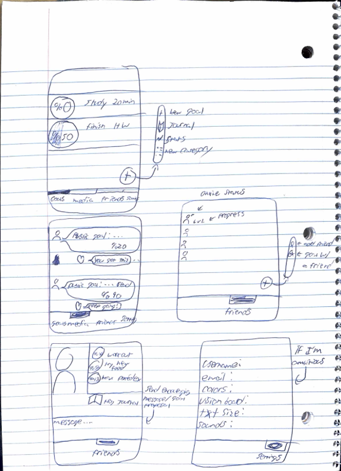
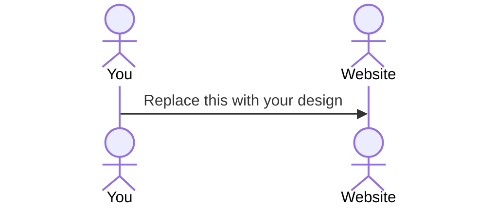

PMG for the homies

[My Notes](notes.md)

Users will be able to create goals and organize them into customized categories. They can choose to make their goals public or prive, public goals can be seen by anyone and poeple can leave hearts and encouragement. Users can friend each other whitch will allow access to create goals together and allow users to read eachothers' progress journals (victories, discouragements, whatever the user writes). Measument of a goal brings improvement, with accountability and positive feedback, the rate of improvement accelerates. 

> [!NOTE]
> This is a template for your startup application. You must modify this `README.md` file for each phase of your development. You only need to fill in the section for each deliverable when that deliverable is submitted in Canvas. Without completing the section for a deliverable, the TA will not know what to look for when grading your submission. Feel free to add additional information to each deliverable description, but make sure you at least have the list of rubric items and a description of what you did for each item.

> [!NOTE]
> If you are not familiar with Markdown then you should review the [documentation](https://docs.github.com/en/get-started/writing-on-github/getting-started-with-writing-and-formatting-on-github/basic-writing-and-formatting-syntax) before continuing.

## 🚀 Specification Deliverable

> [!NOTE]
> Fill in this sections as the submission artifact for this deliverable. You can refer to this [example](https://github.com/webprogramming260/startup-example/blob/main/README.md) for inspiration.

For this deliverable I did the following. I checked the box `[x]` and added a description for things I completed.

- [x] Proper use of Markdown
- [x] A concise and compelling elevator pitch
- [x] Description of key features
- [x] Description of how you will use each technology
- [x] One or more rough sketches of your application. Images must be embedded in this file using Markdown image references.

### Elevator pitch

A place where users can make measurable goals and collaborate on larger goals with friends. Users can recieve positive feedback on their progress from stangers if they choose to make thier goal public and they can recieve written feedback from friends on all of thier goals. As a user completes goals, interacts with others, or makes friends, they make points that they can then spend to buy cool accessories for their avatar. 

### Design

```mermaid
sequenceDiagram
    actor You
    actor Website
    You->>Website: Replace this with your design
```

### Key features

- Ability to create custom goals with a custom measurment 
- Ability to mark these goals as you complete them to show progress
- Ability to keep a journal 
- visible comments from friends and good emojis from strangers on public goals 
- Goals organized in an asthetic way 
- Dm friends to encourage success 
- make goals with friends 
- earn points as user interacts with the website (leaving hearts on public goals, writing to friends, completing / making goals, etc.)
- spend points to get cool accessories on user avatar 

### Technologies

I am going to use the required technologies in the following ways.

- **HTML** - HTML will be used for the skeelton of the website, namely all the views elemts on each view such as login. 
- **CSS** - This will make asthetic pages and customizable features on users' avatar
- **React** - This will be used for when the user makes a goal and updates progress, also for when they write to their friends or in their journal, updates UI with live chats, notifications, tabview after login, 
- **Service** - This will be used to retrieve statistics or previously completed goals or the goals of others in the public goals room. Also to recieve the avatars of each user and their public stats. 
- **DB/Login** - This will be used to store the stats of a user such as their goals, friends, messages, liked posts, and anything else that shouyld presist between machines 
- **WebSocket** - This will be used to allow users to get messages in real time and allow users to see updates in goal progress in real time. Also avatar changes and positive feedback on public goals. 

## 🚀 AWS deliverable

For this deliverable I did the following. I checked the box `[x]` and added a description for things I completed.

174.129.229.80 <- elastic dns (this one works)

ssh -i ~/downloads/key.pem ubuntu@174.129.229.80 <- ssh shortcut

- [x] **Server deployed and accessible with custom domain name** - [epic goals!](https://epicgoals.click).

## 🚀 HTML deliverable

For this deliverable I did the following. I checked the box `[x]` and added a description for things I completed.

- [x] **HTML pages** - I have like 7 pages which is a ton, hopefully this doesn't bite my butt later
- [x] **Proper HTML element usage** - I completed the proper style set up and inspired by the simon example
- [x] **Links** - I navigate between several pages in a tab menu I plan to do
- [x] **Text** - I write text to give little instruciton about how to make a goal, and future text will be given to display goals
- [x] **3rd party API placeholder** - In my settings, I have a placeholder to display inspirational quotes 
- [x] **Images** - I found a cool cog for settings, and I asked chat to make me some mock profile pics to get an idea of how I want it to look
- [x] **Login placeholder** - I made a login placeholder on the index.html 
- [x] **DB data placeholder** - I made a db placeholder with the tables I want to create (sort of)
- [x] **WebSocket placeholder** - This is in the friends and media tab, to see how homie is doing with thier goals. 

## 🚀 CSS deliverable

For this deliverable I did the following. I checked the box `[x]` and added a description for things I completed.

- [x] **Visually appealing colors and layout. No overflowing elements.** - I think it looks ok, but beauty is subjective
- [x] **Use of a CSS framework** - I used bootstrap for nearly all my CSS
- [x] **All visual elements styled using CSS** - All my files have some degree of CSS Styling and use main.css
- [x] **Responsive to window resizing using flexbox and/or grid display** - It doesnt flex in the prettiest way, but it does flex
- [x] **Use of an imported font** - I use an imported font in all of my files (googleapi)
- [x] **Use of different types of selectors including element, class, ID, and pseudo selectors** - I used this all, somewhat scattered but most can me found in my index.html.
## 🚀 React part 1: Routing deliverable

For this deliverable I did the following. I checked the box `[x]` and added a description for things I completed.

- [x] **Bundled using Vite** - So vite works and it is a super good debugger!
- [x] **Components** - I have made jsx files for all of my html files and my files are organized into the way that vite likes it. All my files still rely havily on the main.css or inline bootstrap, bit the css files for each jsx file have been created in case this changes. 
- [x] **Router** - There are like 7 files the router touches, and some files import NavLink so that files can be access outside the header inside other files.

## 🚀 React part 2: Reactivity deliverable

For this deliverable I did the following. I checked the box `[x]` and added a description for things I completed.

- [x] **All functionality implemented or mocked out** - Circles are now dynamic and you can fill them up as you click. you can add and delete goals, each goal has a specific name and type login and password now work with the rest of the app being unaccessable otherwise. This is all the key parts of the app, the rest is bonus, but i will implement that later, for now this is just to get the credit 
- [x] **Hooks** - i useState, useEffect, useRef, and useMemo, it was fun learning the specific roles of each one, and it all comes together once you get used to it. 

## 🚀 Service deliverable

For this deliverable I did the following. I checked the box `[x]` and added a description for things I completed.

- [x] **Node.js/Express HTTP service** - index.js, server happens on port 4000
- [x] **Static middleware for frontend** - also in the index.js file. app.use(express.static('public'))
- [x] **Calls to third party endpoints** - Anthropic API!!! This is so exciting for me, to use it, click the white button with the black star on the top left by the "GOALS" title. Also the bot has been prompted to stick with goal related subject, that way users can get help with their goals if they need
- [x] **Backend service endpoints** - login, logout, AIchat, goals, and create endpoints
- [x] **Frontend calls service endpoints** - loging/signup auth create, and AI chat panel (new jsx) calls api. 
- [x] **Supports registration, login, logout, and restricted endpoint** - theres middleware to restrict access to authenticated users, BCrypt hashed passwords

## 🚀 DB deliverable

For this deliverable I did the following. I checked the box `[x]` and added a description for things I completed.

- [x] **Stores data in MongoDB** -  Goals are stored in the goal collection — addPersonalGoal() and addPartnerGoal() insert into MongoDB, getPersonalGoals() and getPartnerGoals() read from it
- [x] **Stores credentials in MongoDB** - regiateration, login, logout, and authorization are stored in mongodb and hashed, whena. user logs in again, or creates an accuont, their info is stored. 

## 🚀 WebSocket deliverable

For this deliverable I did the following. I checked the box `[x]` and added a description for things I completed.

- [x] **Backend listens for WebSocket connection** - index.js has WEbSocketServer with upgrade on /ws, connection listener
- [x] **Frontend makes WebSocket connection** - gameNotifier.js (originally copied from simon, adjusted to match the needs of my app) notifies about publishing goals. 
- [x] **Data sent over WebSocket connection** - 5 events are broadcast, gaolPublished, goalUnpublished, goalProgressUpdate, avataChange
- [x] **WebSocket data displayed** - Live updates for new goals, removed goals, progress updates, and avatar changes.
- [x] **Application is fully functional** - Everything is working that I want working! I think no mocks remain, did a sweep with ai to check for TODO or Placeholder keyowrds, so, i think its good. 
